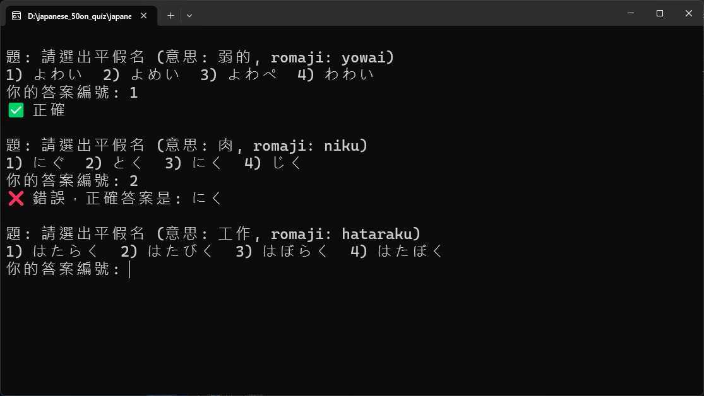
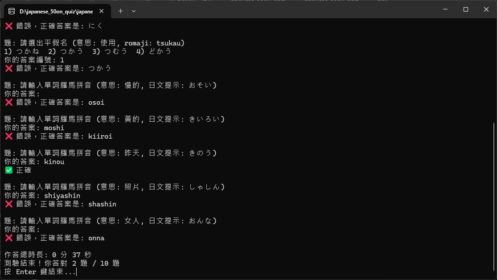

# japanese_50on_quiz / 日語50音測驗

## 簡介 Introduction

這是一個簡單的日語學習測驗工具，主要功能是練習 **平假名與片假名** 及基礎單詞。  
The Kana Quiz is a simple Japanese learning tool designed to practice **Hiragana, Katakana**, and basic vocabulary.

- 支援從外部 `words.txt` 載入單字，可自行新增單字。  
- Supports loading vocabulary from an external `words.txt` file, allowing you to add your own words.  
- 可以直接執行 `exe` 版本，並同樣支援新增單字到 `words.txt`  
- Can run directly as an `exe` file, still allows adding new words to `words.txt`  
- 提供兩種題型：  
  1. 顯示羅馬拼音 → 選出正確平假名  
  2. 顯示平假名 → 輸入對應羅馬拼音  
- Two question types:  
  1. Romaji → choose the correct kana  
  2. Kana → type the corresponding Romaji  

- 前五題：羅馬拼音 → 選平假名  
- 後五題：平假名 → 輸入羅馬拼音  
- First 5 questions: Romaji → choose kana  
- Last 5 questions: Kana → type Romaji  

- 計時功能，最後顯示總作答時間  
- Timer included, shows total time taken at the end  

---

## 使用方法 Usage

1. 安裝 Python 3.9+（若使用 `.exe` 可跳過此步驟）  
   Install Python 3.9+ (skip this step if using the `.exe` version)  
2. 將 `hiragana_quiz.py` 與 `words.txt` 放在同一個資料夾，或直接使用 `.exe` 與 `words.txt`  
   Place `hiragana_quiz.py` and `words.txt` in the same folder, or just use the `.exe` with `words.txt`  
3. 執行 Python 腳本或 `.exe`  
   Run the Python script or the `.exe`:  
   ```bash
   python hiragana_quiz.py

## 操作示意
- 測驗過程

- 測驗結果
